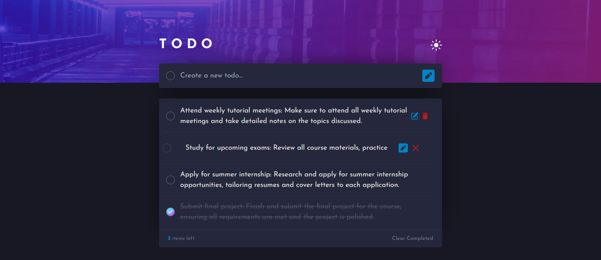

#  Todo App



- Live Preview ⭕🔗: https://todo-app-steel-three.vercel.app

## Introduction

Welcome to **Todo App**, a simple web application that allows users to add, remove, and update tasks from a. It uses React and is built with a responsive design that adapts to different screen sizes. It also provides a dark mode theme for a more visually appealing experience.

It uses Supabase as its backend. Supabase is an open-source alternative to Firebase and AWS Amplify. Todo App uses Supabase to store and retrieve data from its database.

## Technologies Used

Todo is built using the following technologies:

[](https://skillicons.dev)

## Installation

To run Calc locally on your machine, follow these steps:

1. Clone the repository:

   ```bash
   git clone https://github.com/MostafaSaafan5517/todo-app.git
   ```

Enjoy Coding 👨‍💻
